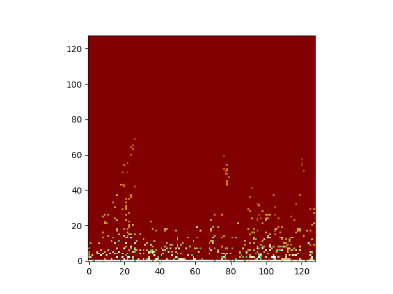

# Fire effects a la Doom 

Simple implementation of fire effects as in the Doom game intro.
The code is the adaptation of the javascript version by Fabien Sanglard. 
Done only for fun and to learn a bit more about Python.

It should produce something like:

See here: http://fabiensanglard.net/doom_fire_psx/
and there: https://github.com/fabiensanglard/DoomFirePSX/blob/master/flames.html
